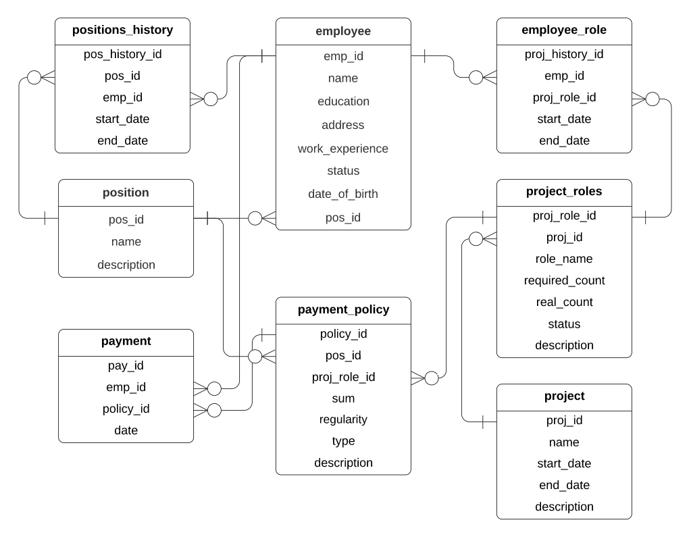
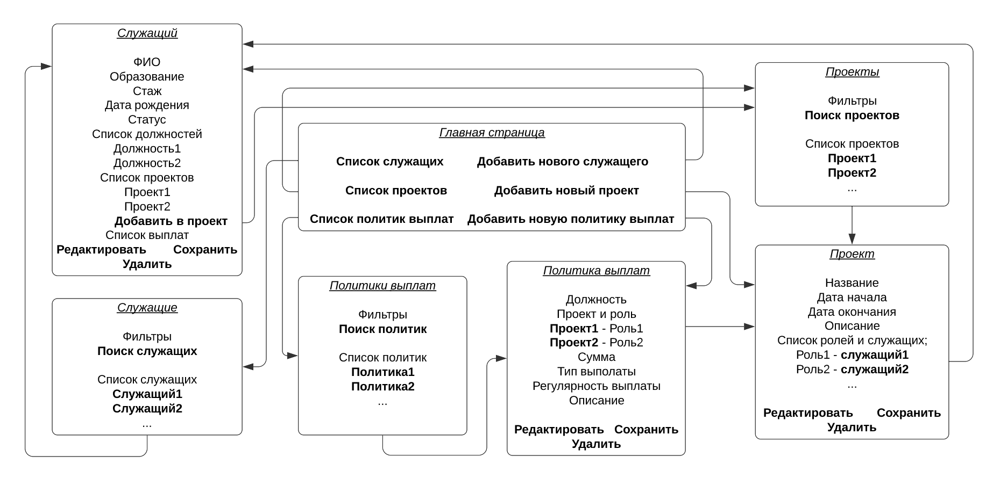

# Система управления информацией о зарплатах служащих компании

## Оглавление
1. [База данных](#База-данных)
2. [Описание страниц](#Описание-страниц)
3. [Сценарии использования](#Сценарии-использования)
4. [Требования](#Требования)

## База данных

## Описание страниц
#### Схема страниц(курсивом выделены названия страниц, жирным - кнопки):

Также на каждой странице будет ссылка на главную.
И на страницах *служащий*, *проект* и *политика выплат* будут ссылки "назад" на страницы *служащие*, *проекты* и *политики выплат* соответственно.
В списках служащих, политик и проектов будут краткие сведения о каждом.

Схемы также можно посмотреть по [ссылке](https://lucid.app/lucidchart/39ed11fe-04e1-4831-8997-69f9b7f8dcd5/edit?shared=true&invitationId=inv_8928e2ff-b524-40cc-996f-c4339d60cfaa&page=0_0#).

## Сценарии использования
### Получение списка служащих, в т.ч. по должностям, проектам, стажу, премированных и пр.
1. Зайти на страницу *служащие*.
2. Установить нужные фильтры.
3. Нажать **поиск служащих**.
### Получение истории участия в проектах, карьерной истории для служащего и истории выплат для служащего
1. Зайти на страницу *служащие*.
2. Найти нужного служащего в списке (например, написав ФИО в фильтрах).
3. Перейти на страницу *служащий*, кликнув по нужной строке из списка.
4. Проекты, должности и выплаты служащего будут в соответствующих списках.
### Назначение служащего на новую должность
1. Зайти на страницу *служащие*.
2. Найти нужного служащего в списке (например, написав ФИО в фильтрах).
3. Перейти на страницу *служащий*, кликнув по нужной строке из списка.
4. Нажать **редактировать**.
5. В появившуюся пустую строку в списке должностей написать нужную информацию.
6. Нажать **сохранить**.
### Добавление служащего в проект
1. Зайти на страницу *проекты*.
2. Найти нужный проект в списке (например, написав его название в фильтре).
3. Перейти на страницу *проект*, кликнув по нужной строке из списка.
4. Нажать **редактировать**.
5. Либо назначить служащему уже существующую незанятую роль, либо в появившуюся пустую строку написать новую роль и назначить на неё служащего.
6. Нажать **сохранить**. 
### Удаление служащего из проекта
1. Зайти на страницу *проекты*.
2. Найти нужный проект в списке (например, написав его название в фильтре).
3. Перейти на страницу *проект*, кликнув по нужной строке из списка.
4. Нажать **редактировать**.
5. В соответствующей служащему строке удалить его ФИО (останется только роль).
6. Нажать **сохранить**.
### Добавление служащего
1. Нажать **добавить нового служащего**.
2. На странице *служащий* заполнить пустые поля.
3. Нажать **сохранить**.
### Удаление служащего, чтение данных о нем
1. Зайти на страницу *служащие*.
2. Найти нужного служащего в списке (например, написав ФИО в фильтрах).
3. Перейти на страницу *служащий*, кликнув по нужной строке из списка.
4. Посмотреть данные о служащем, или удалить служащего, нажав **удалить**.
### Редактирование данных о служащем
1. Зайти на страницу *служащие*.
2. Найти нужного служащего в списке (например, написав ФИО в фильтрах).
3. Перейти на страницу *служащий*, кликнув по нужной строке из списка.
4. Нажать **редактировать**.
5. Изменить нужные поля.
6. Нажать **сохранить**.
### Добавление и удаление проекта, чтение и редактирование данных о нем
Аналогично двум предыдущим сценарию.
### Добавление и удаление политик выплат, чтение и редактирование данных о них
Аналогично предыдущему сценарию.

_____
## Требования

1. **Поддерживаемые данные**
    - Служащие
        - ФИО
        - Домашний адрес
        - Дата рождения
        - Образование
        - Стаж работы в компании
        - Текущая должность
        - Участие в проектах и выполняемые роли
        - История занимаемых должностей и участия в проектах
        - Общая история всех выплат
        - Премии и даты их выписки
    - Проекты
        - Название, даты начал и окончания
        - Роли в проекте (руководитель, аналитик, секретарь, эксперт)
    - Политики выплат
        - По должностям
        - По проектам и ролям
        - За стаж
        - Премиальные на Новый год, дни рождения, круглые даты в истории компании

2. **Поддерживаемые операции**
    - Получение списка служащих, в т.ч. по должностям, проектам, стажу, премированных и пр.
    - Получение истории участия в проектах и карьерной истории для служащего
    - Получение истории выплат для служащего
    - Назначение служащего на новую должность, добавление в/удаление из проекта
    - Добавление и удаление служащего, чтение и редактирование данных о нем
    - Добавление и удаление проекта, чтение и редактирование данных о нем
    - Добавление и удаление политик выплат, чтение и редактирование данных о них
